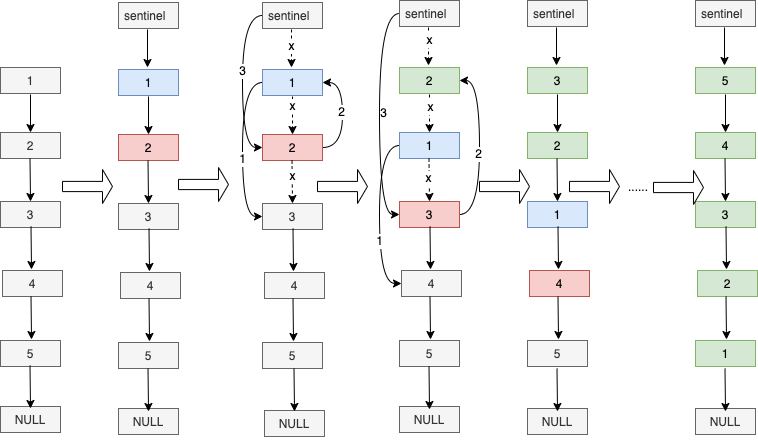

# 反转链表


- 处理链表问题，一般加个哨兵节点能使问题变得简单很多，所以第一步我们创建哨兵节点执行原链表的1号节点
- 第二步，将2号节点插入哨兵节点和首节点之间，1号节点指向3号节点
- 第三步，同样的方式将3号节点插入哨兵节点和2号节点之间
- 按上面的方式，直到1号节点指向NULL，反转完成  

执行过程中有几个关键点，每次反转的对象都是1号节点的下一个节点，每次都是将反转对象插入到哨兵节点下方。
修改指向过程中要注意先改1号节点的指向，再修改反转对象的指向，最后修改哨兵节点的指向。

### 代码实现
```
type Node struct {
	Val  int
	Next *Node
}

func ReverseList(sentinel *Node) *Node {
	head := sentinel.Next
	for head.Next != nil {
		toReverse := head.Next
		head.Next = toReverse.Next
		toReverse.Next = sentinel.Next
		sentinel.Next = toReverse
	}
    // 设置尾节点
	head.Next = nil
	return sentinel.Next
}
```


### 复杂度
- 时间复杂度：O(n)  
- 空间复杂度：O(1)