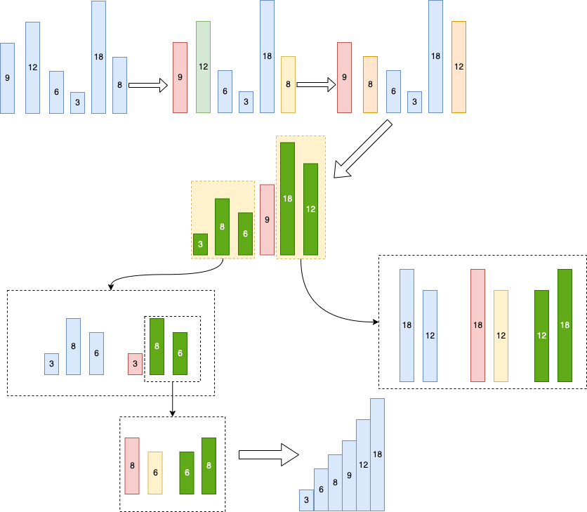

# 快排

快排是选取一个数作为基准值，将大于和小于这个数的其他数分别放到这个数两侧，然后对两侧的数进行同样的处理，直到完成排序。如下图对[9, 12, 6, 3, 18, 8]排序：


- 首先选9作为基准值，从左往右找较大值，从右往左找较小值，若都能找到两者替换位置如图12和8替换，替换后接着找，下一个较小值是3，较大值是18由于较大值已经在较小值的右侧了，所以就不用交换位置了。接下来将基准值和最右侧的较小值也就是3交换位置，将较小值和较大值分别放到了基准值9的两侧，第一轮循环完成。
- 接着对基准值两边的数进行同样的操作，直到全部数据排序完成。


### 代码实现
```
func QuickSort(arr []int, start, end int) {
	fmt.Println(arr, start, end)
	if len(arr) < 2 {
		return
	}
	if start >= end {
		return
	}
	base := arr[start]
	midIdx := start
	i := start + 1
	j := end
	for {
		// 从左往右找较大数
		for i <= end {
			if arr[i] > base {
				break
			}
			i++
		}
		// 从右往左找较小数
		for j > start {
			if arr[j] < base {
				midIdx = j
				break
			}
			j--
		}
		if i >= j {
			break
		}
		// 小数左移，大数右移
		arr[i], arr[j] = arr[j], arr[i]
	}
	// 如果基准值右边存在更小的数，将基准值移至中间
	if midIdx != start {
		arr[midIdx], arr[start] = arr[start], arr[midIdx]
	}
	// 基准值已经位于中间
	QuickSort(arr, start, midIdx-1)
	QuickSort(arr, midIdx+1, end)
}
```

### 复杂度
时间复杂度：平均情况O(nlog(n))，最坏情况O(\\( n^2 \\))。取决于每次基准值的选取情况，若每次都正好选到中间值执行效率最优，若每次都是最小值或最大值则相当于选择排序复杂度为O(\\( n^2 \\))。  
空间复杂度：O(1)  