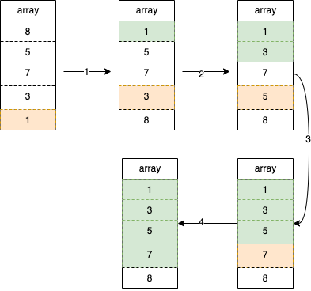

# 选择排序

### 执行流出
选择排序就是遍历数组找到最小那个，然后和遍历初始位置那个数交换。如下图初始数组[8, 5, 7, 3, 1]，首先从最开始遍历找到最小数1，然后和遍历初始位置的8互换，这时候1就相当于是排好序的了，按同样的方式处理剩下的[5, 7, 3, 8]找到最小值3然后和初始值5交换，这样[1, 3]就相当于是排好序的了，按同样的方式继续处理。


### 代码示例
```Go
func SelectionSort(arr []int) []int {
	for i := 0; i < len(arr)-1; i++ {
		minIdx := i
		for j := i + 1; j < len(arr); j++ {
			if arr[j] < arr[minIdx] {
				minIdx = j
			}
		}
		arr[i], arr[minIdx] = arr[minIdx], arr[i]
	}
	return arr
}
```
### 复杂度
- 时间复杂度O(\\( n^2 \\))  
 第一次内循环比较n-1次接下来一次递减最后一次是1，总次数：n-1+n-2+n-3+...+1 = (n-1+1)*(n/2) = \\( n^2/2 \\)，时间复杂是O(\\( n^2 \\))
- 空间复杂度O(1)   
由于没有使用额外空间，在数组自身上修改的原值，所以空间复杂度是O(1)